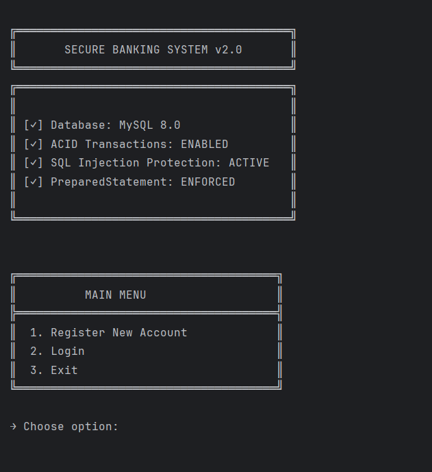
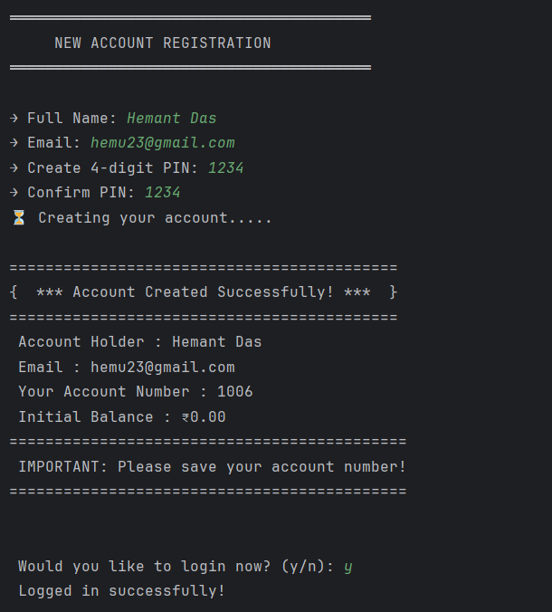

# Banking Management System

A robust, Java-based banking application simulating core financial operations directly from the command line. This project demonstrates Object-Oriented Programming (OOP), JDBC Database Connectivity, and secure transaction management.
## Features

-   **Secure Authentication:** User login with PIN verification.
-   **ACID Transactions:** Deposits and Withdrawals are atomic, if a log fails, the money is rolled back.
-   **Database Integration:** Fully connected to MySQL for persistent data storage.
-   **Interactive UI:** Console-based interface with loading effects, ANSI styling, and input validation.
-   **Account Management:** Real-time balance checks and account registration.

## Interface Previews

**Main Menu:**

**Account Registration:**

## Tech Stack


-   **Language:** Java (JDK 17+)
-   **Database:** MySQL
-   **Concepts:** JDBC, OOP, Exception Handling, Singleton Pattern (Connection),PreparedStatements, Input Sanitization.


## Database Schema

Two main tables :

**users** - Stores account information (account_number, name, email, balance, PIN)  
**transactions** - Logs all operations (type, amount, timestamp)

## Setup

1. **Create MySQL database and tables:**

Open MySQL Workbench or command line and run:
```sql
CREATE DATABASE bank_system;
USE bank_system;

CREATE TABLE users (
    account_number INT PRIMARY KEY AUTO_INCREMENT,
    full_name VARCHAR(100) NOT NULL,
    email VARCHAR(100) UNIQUE NOT NULL,
    balance DECIMAL(15,2) DEFAULT 0.00,
    security_pin VARCHAR(10) NOT NULL,
    created_at TIMESTAMP DEFAULT CURRENT_TIMESTAMP
);

CREATE TABLE transactions (
    transaction_id INT PRIMARY KEY AUTO_INCREMENT,
    account_number INT,
    transaction_type VARCHAR(20),
    amount DECIMAL(15,2),
    transaction_date TIMESTAMP DEFAULT CURRENT_TIMESTAMP,
    FOREIGN KEY (account_number) REFERENCES users(account_number)
);
```

2. **Update database credentials:**

Open `DatabaseConnection.java` and change:
```java
private static final String PASSWORD = "your_mysql_password";
```

3. **Add MySQL JDBC driver to your project classpath**

4. **Run Application:**
    Compile and run `BankingApp.java`.

    ```bash
    javac -cp ".;mysql-connector-j-9.5.0.jar" *.java
    java -cp ".;mysql-connector-j-9.5.0.jar" BankingApp
    ```

##  Safety Mechanisms

-   **SQL Injection Prevention:** Uses `PreparedStatement` for all queries.
-   **Input Validation:** Prevents negative deposits and validates data types (prevents `InputMismatchException`).
-   **Transaction Safety:** Uses `conn.setAutoCommit(false)` to ensure data integrity during funds transfer.

## What I Learned

This project helped me understand:
- How Java applications connect to databases using JDBC
- Preventing SQL injection with PreparedStatement
- Database transactions to ensure data consistency
- Proper error handling and input validation
## Key Challenges

**Scanner Buffer Issue:** Fixed input skipping by adding `scanner.nextLine()` after numeric inputs

**Transfer Safety:** Implemented transactions with rollback to prevent money loss if operation fails midway

**SQL Injection Risk:** Switched from string concatenation to PreparedStatement for all queries

## Notes

This is a learning project. Security features like password hashing are not implemented.

---

**Author :** Dev Adhikari  
**Built with :** Java, MySQL, JDBC                                                                   
**Email :** devadhikari5665@gmail.com                                                                                                                                                                   
**GitHub :** [@whyDev07](https://github.com/whyDev07)  
**Project Link :** [View Repository](https://github.com/whyDev07/Simple_Banking_System)
